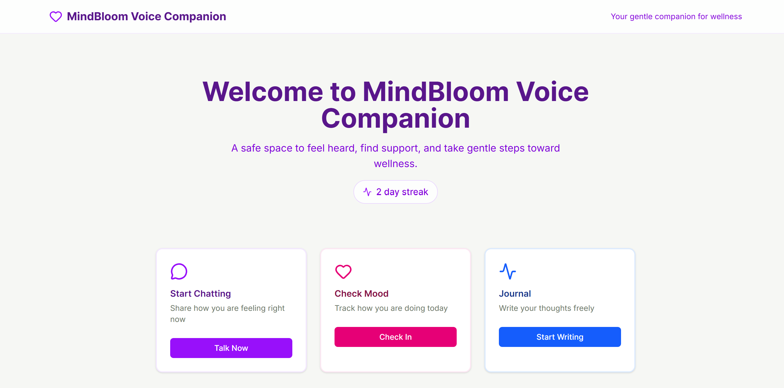
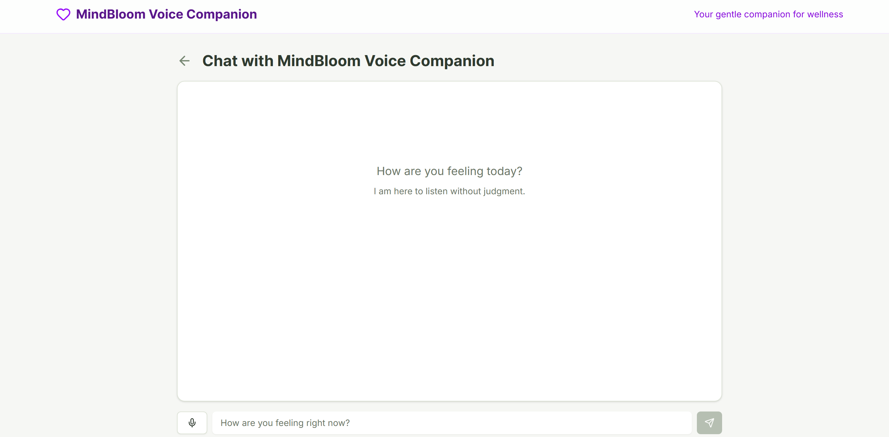
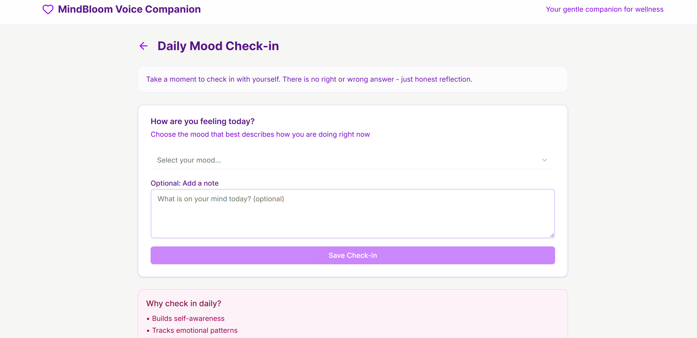
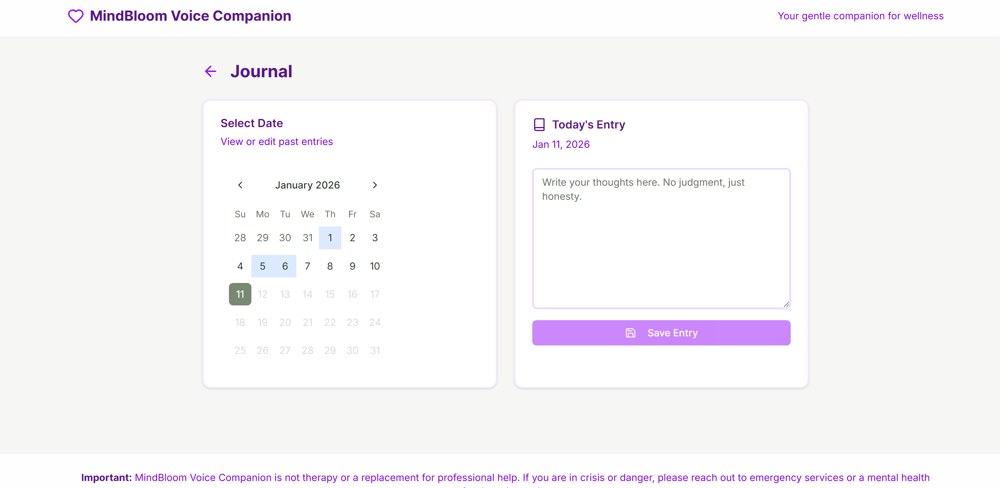
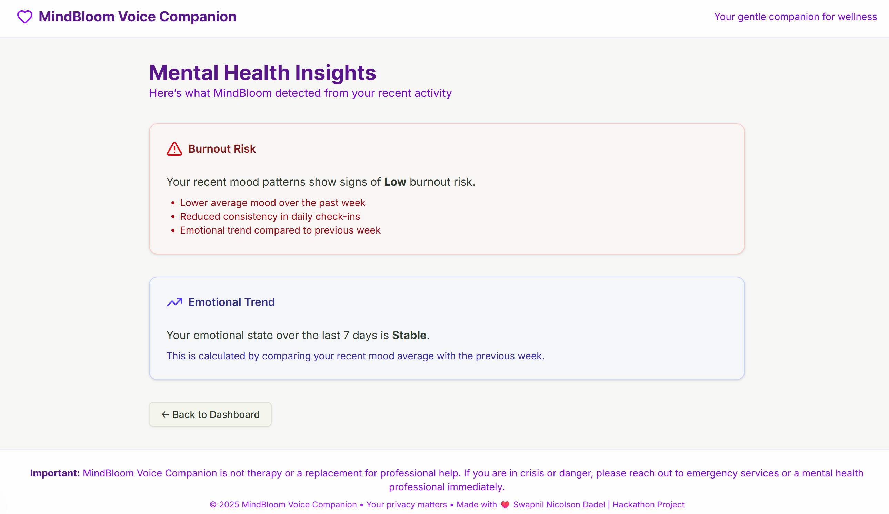
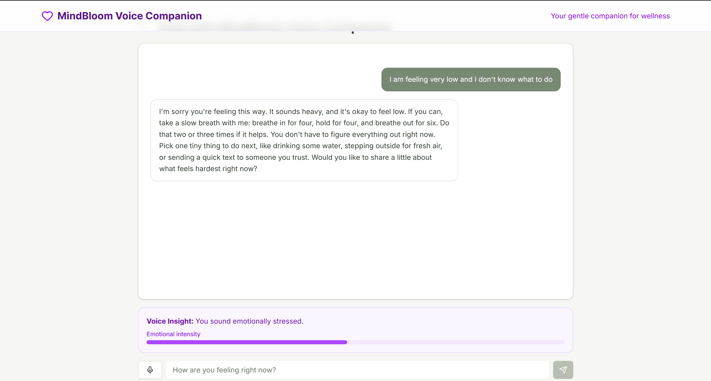

# 🎙️ MindBloom Voice — AI Burnout Detection & Mental Insights

MindBloom Voice is an **AI-powered mental insight system** that helps students and young professionals **detect burnout early**, understand emotional trends, and receive **actionable guidance** — all while remaining **private, lightweight, and non-clinical**.

Unlike typical mental health apps, MindBloom does not focus on motivation or therapy.  
It focuses on **early risk detection and prevention**.

---

## 🧠 The Problem

Students today face:

- Academic pressure and constant deadlines  
- Career uncertainty and job instability  
- Financial stress  
- Emotional burnout and mental fatigue  
- Limited access to counselling due to cost, stigma, or wait time  

Most people don’t need therapy immediately.  
They need **early signals**, **clarity**, and **small corrective actions** *before burnout escalates*.

However:
- Burnout is rarely detected early  
- Emotional decline often goes unnoticed  
- Existing apps focus on journaling or motivation, not **risk detection**

---

## 🌱 The Solution — MindBloom Voice

MindBloom Voice is a **mental risk detection companion** that:

- Analyzes mood patterns over time  
- Detects **burnout risk** using explainable logic  
- Tracks **emotional trends week-over-week**  
- Provides **AI-generated preventive recommendations**  
- Supports **hands-free voice interaction** for moments of fatigue  

No diagnosis  
No medical claims  
No pressure  

Just **early insight and guidance**

---

## ✨ Key Features

### 🧠 Burnout Risk Detection (Core Feature)
- Calculates burnout risk using recent mood patterns  
- Detects declining emotional trends  
- Shows **Low / Medium / High** risk clearly on the dashboard  
- Transparent and explainable logic (not a black box)

### 📊 Emotional Trend Analysis
- Compares last 7 days vs previous 7 days  
- Identifies improving, stable, or declining emotional states  
- Helps users understand patterns instead of guessing

### 🤖 AI Recommendation Engine
- Generates **short, practical guidance** based on detected risk  
- Focuses on prevention and productivity-safe advice  
- Uses AI meaningfully — not just for chat

### 🎤 Voice-First Accessibility
- Speak instead of typing using browser SpeechRecognition  
- AI replies can be read aloud using SpeechSynthesis  
- Designed for moments of stress, fatigue, or overwhelm  
- No paid voice services — browser APIs only

### 📓 Smart Journaling
- Journal entries linked to calendar dates  
- Edit and revisit past entries  
- Journals support emotional reflection (not analysis)

### 😊 Mood Tracking
- Simple daily mood check-ins  
- Mood data feeds directly into burnout detection logic  
- Helps convert feelings into measurable insight

### 🔒 Privacy-First by Design
- 100% local storage  
- No database  
- No authentication  
- No tracking  
- No data leaves the user’s device (except AI requests)

---

## 🖼️ Screenshots

## 📸 Mindbloom Voice – Product Walkthrough









---

## 🚀 Live Demo

🎬 **YouTube Demo**  
https://youtu.be/S9k_euZsN_g

🔗 **Vercel Deployment**  
https://mindbloom-voice.vercel.app/

---

## 🛠️ Tech Stack

### Frontend
- Next.js (App Router)
- TypeScript
- Tailwind CSS
- shadcn/ui

### AI & Backend
- OpenRouter API  
- Model: `tngtech/deepseek-r1t2-chimera:free`  
- Server-side Node.js runtime  
- Safety-filtered AI responses  

### Storage
- Browser LocalStorage only  
- No backend database  
- No authentication  

---

## 🧩 Architecture Overview

```text
src/
├── app/
│   ├── api/chat/        # Server-side AI logic
│   ├── chat/            # Voice + text chat UI
│   ├── journal/         # Journaling feature
│   ├── mood/            # Mood tracking
│   ├── insights/        # Burnout & trend explanations
│   └── page.tsx         # Dashboard (source of truth)
├── components/shared/   # Reusable layout components
├── lib/
│   ├── hooks/useChat.ts # Chat logic abstraction
│   └── storage/         # LocalStorage abstraction
├── agents/
│   └── ai-agents.ts     # AI behavior & safety rules
└── types/
    └── index.ts         # Centralized types
```

## 🔐 Privacy & Safety
- All personal data stays on the user’s device
- AI is used for insight, not diagnosis
- Clear safety disclaimers
- Encourages professional help when needed
- No medical or therapeutic claims

## ⚠️ Important Disclaimer

MindBloom Voice is not therapy or medical advice.
If you are in crisis or immediate danger, please contact local emergency services or a mental health professional.

## 🎯 Hackathon Objectives

This project was built to:
- Detect burnout before it escalates
- Use AI for real-world problem solving, not gimmicks
- Stay beginner-friendly while solving a serious issue
- Demonstrate clean architecture and explainable logic
- Prioritise privacy and accessibility

## 🚀 Getting Started
Prerequisites
- Node.js 18+
- npm / yarn / pnpm
- OpenRouter API key (or compatible AI API)

Installation
```
npm install
```
Environment Setup

Create a .env.local file:
```
OPENROUTER_API_KEY=your_api_key_here
```

⚠️ Do not commit .env.local

Run Locally
```
npm run dev
```

Open:
```
http://localhost:3000
```

## 🔮 Future Work

MindBloom Voice is intentionally designed as a **lightweight, privacy-first prototype**.  
With more time and resources, it can be extended in the following high-impact directions:

### 🎙️ True Voice-Based Sentiment Analysis
- Current sentiment inference is **language-based** (text extracted from speech)
- Future versions will analyze **acoustic features** such as:
  - pitch variation
  - speech rate
  - pauses and hesitation patterns
- This would allow more accurate detection of masked emotions and vocal stress
- All processing would remain **on-device or privacy-preserving**

### 🧠 Lightweight ML Models for Trend Prediction
- Introduce simple ML models (e.g. regression or time-series analysis)  
- Predict **future burnout risk** based on historical mood and voice patterns  
- Help users take preventive action earlier

### 📈 Long-Term Emotional Insights
- Monthly and quarterly emotional summaries  
- Detection of recurring stress cycles (e.g. exam periods, deadlines)
- Personalised insights rather than generic recommendations

### 🤝 Optional Trusted Sharing
- Allow users to **export encrypted summaries**
- Share insights with:
  - a trusted friend
  - mentor
  - therapist (optional, user-controlled)
- No social feed or public sharing

### 🌍 Multilingual & Cultural Support
- Support non-English voice input
- Adapt sentiment signals for cultural and linguistic nuances
- Improve accessibility for a global audience

### ♿ Accessibility & Mobile Optimization
- Improved mobile UX for low-energy situations
- Better screen reader support
- Offline-first enhancements

### 🛡️ Advanced Safety & Ethics Controls
- More nuanced crisis escalation logic
- User-configurable safety preferences
- Transparent explanation of AI behaviour and limitations

---

MindBloom Voice aims to evolve into a **preventive mental wellbeing tool** —  
not by replacing professionals, but by helping users recognise early warning signs and act responsibly.

---

## 🙌 Author

Built by Swapnil Nicolson Dadel
For students who don’t need therapy -
they need clarity, calm, and early signals 🌱

---

## 📬 Contact

If you’d like to connect, collaborate, or discuss opportunities, feel free to reach out:

- 📧 Email: **swapnilnicolson.201@gmail.com**
- 💼 GitHub: https://github.com/swapitsneil

I’m open to feedback, collaboration, and job opportunities.
